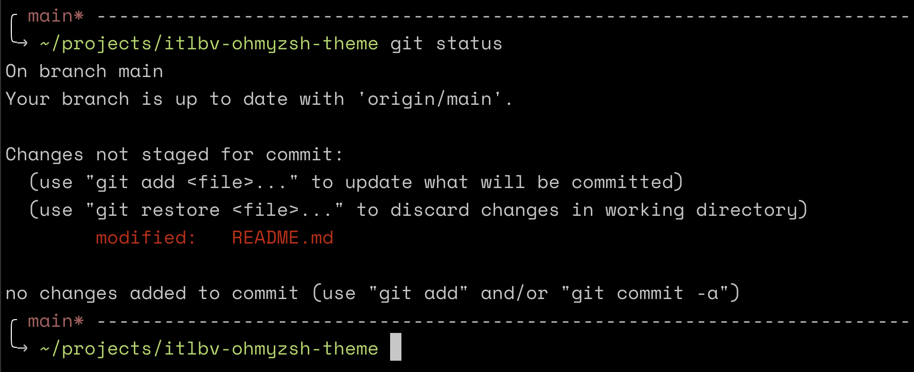

# itlbv-ohmyzsh-theme
A minimal theme for Oh My Zsh.



## Installation
1. Download [itlbv.zsh-theme](https://raw.githubusercontent.com/itlbv/itlbv-ohmyzsh-theme/main/itlbv.zsh-theme)
2. Put it into $ZSH_CUSTOM/themes/
3. Configure the theme in your ~/.zshrc file:
```
ZSH_THEME="itlbv"
```

Works best with Space Mono Powerline font, see [https://github.com/powerline/fonts](https://github.com/powerline/fonts)

The dashed separator function is based on af-magic theme created by Andy Fleming [http://andyfleming.com](http://andyfleming.com)

